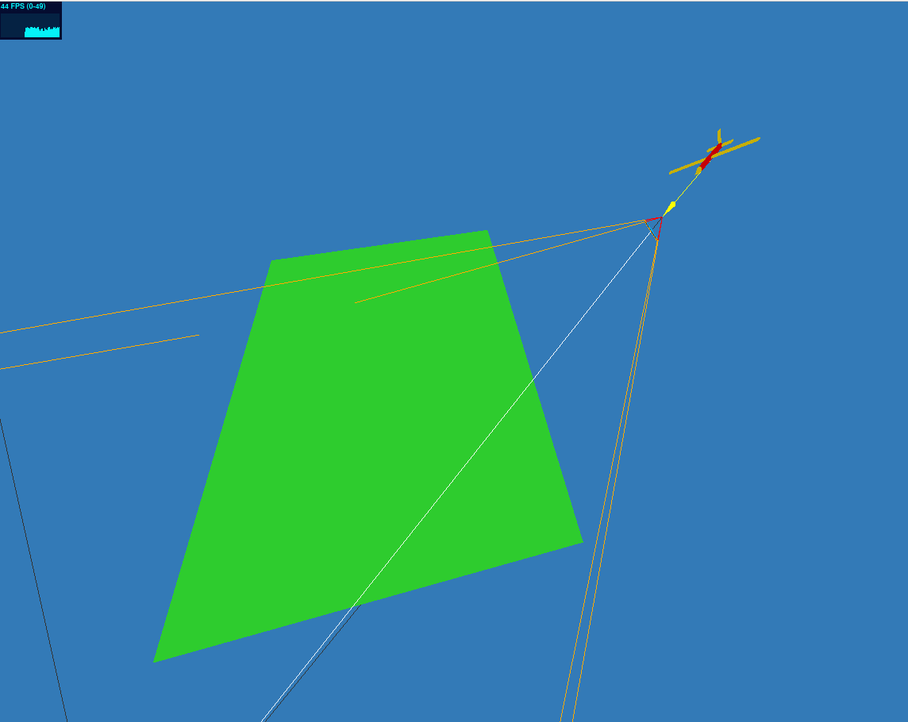

### Mavlink 3D-Map

This tool receives navigation information via MAVLINK, and display vehicles in 3D environment using [three.js ](https://threejs.org/ "three.js ").

The solution also reads canvas and send it back via websocket to ffmpeg.

### Feature

- Reads vehicle location and orientation via mavlink.
- Display vehicles in 3D Map.
- Add cameras to vehicles and allows fpv.
- Ability to read canvas and send it back via websocket to ffmpeg where you can stream it or send it to virtual video driver.

### App Structure

The application has three parts:
- **Website** that runs and uses websockets.
- **UDP2WebSocket** this is a nodejs app that receives udp packets from **SITL** and send equivelant data via websocket to Website.
- **FFMPeg Connector** that receives graphics data from website and forwards it to a virtual vido driver. It also can stream if required.

